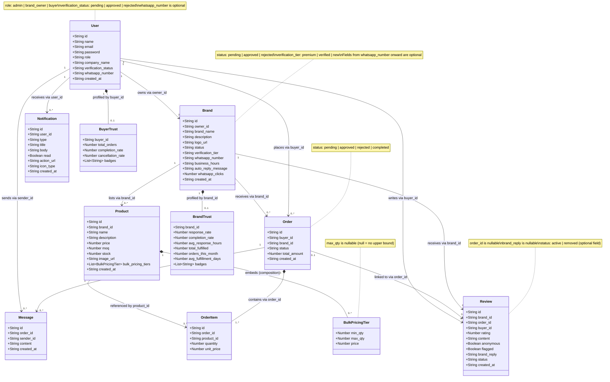
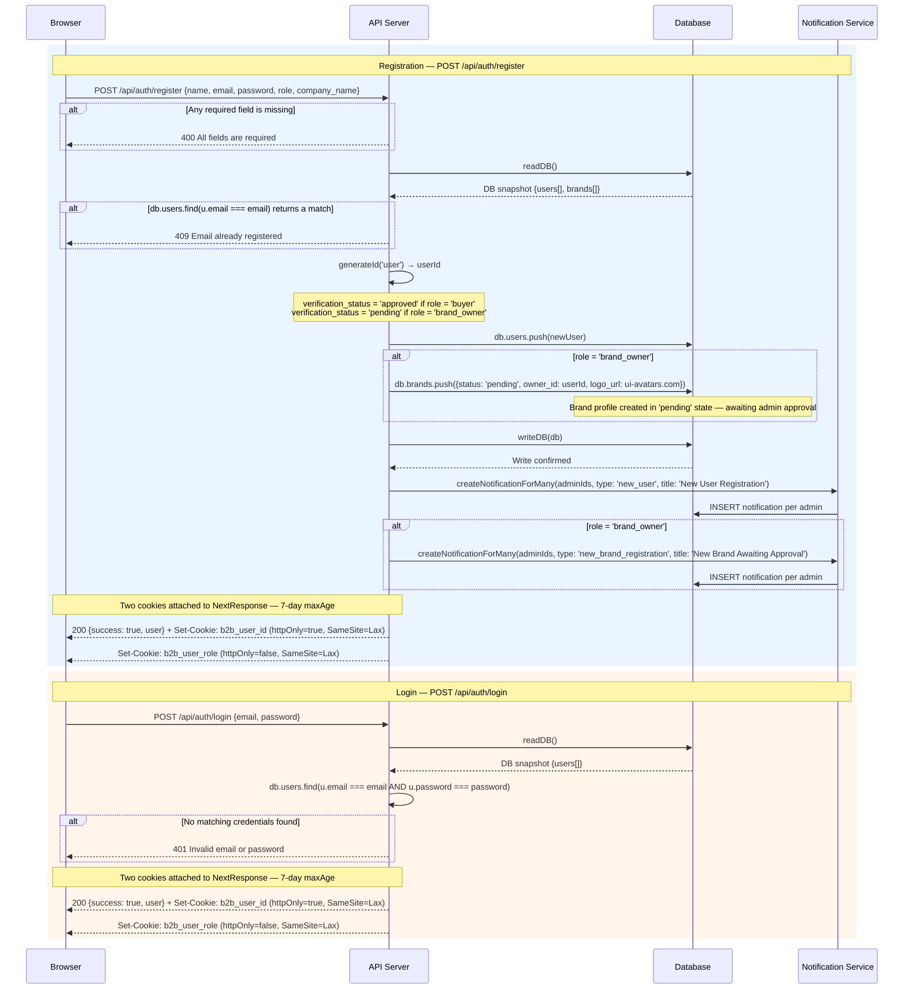
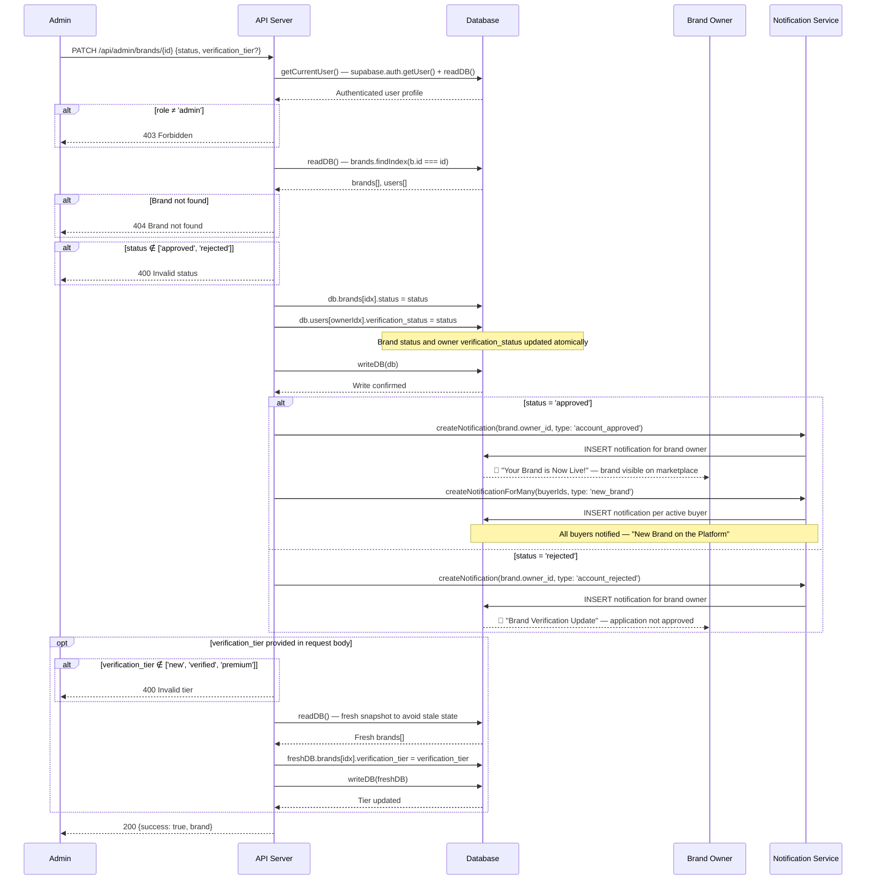
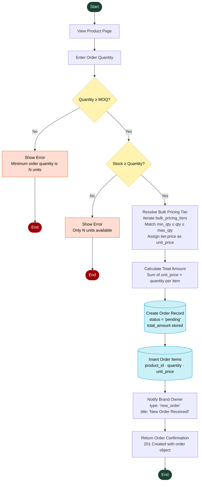
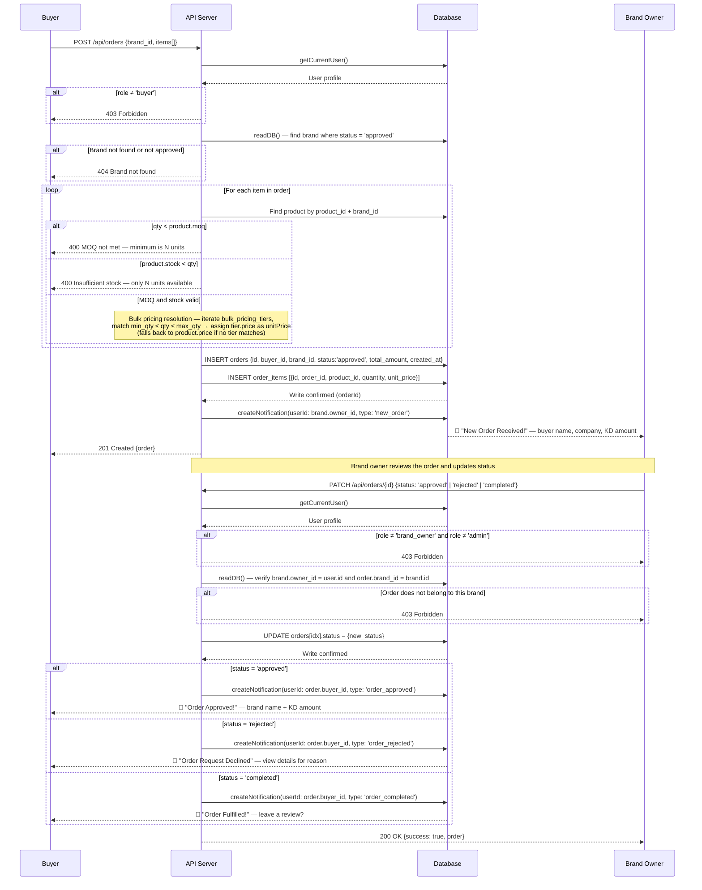

# Kuwait B2B Hub — Final Report Additions

> **Document purpose:** Compiled additions for the Software Engineering Final Report.
> Sections are ready to paste directly into the main report document.

---

## Table of Contents

**Chapter IV — System Design & Implementation**
- [4.2 Coding Artefacts & Project Structure](#42-coding-artefacts--project-structure)
- [4.4 Make, Buy, or Lease Analysis](#44-make-buy-or-lease-analysis)
- [4.5 Configuration Management](#45-configuration-management)
- [4.6 Development & Deployment Specification](#46-development--deployment-specification)

**Chapter V — System Evaluation**
- [5.1.1 Source Lines of Code (SLOC) & Automated Testing Assessment](#511-source-lines-of-code-sloc--automated-testing-assessment)

**Chapter VI — System Evolution**
- [6.1–6.6 System Evolution (Lehman's Laws, Anticipated Changes, 10-Year Forecast)](#61-overview)

**Chapter VII — Project Management**
- [7.5 CoCoMo Cost Estimation](#75-cocomo-cost-estimation)
- [7.6 Risk Assessment Matrix (RAM)](#76-risk-assessment-matrix-ram)

**Appendix A — System Diagrams**
- [Figure 5. Sequence Diagram — User Registration & Login](#figure-5-sequence-diagram--user-registration--login)
- [Figure 6. Sequence Diagram — Order Placement & Review Lifecycle](#figure-6-sequence-diagram--order-placement--review-lifecycle)
- [Figure 7. Sequence Diagram — Brand Verification](#figure-7-sequence-diagram--brand-verification)
- [Figure 8. Class Diagram — Core Entities](#figure-8-class-diagram--core-entities)
- [Figure 9. Activity Diagram — Order Placement](#figure-9-activity-diagram--order-placement)

**Appendix B — Critical Source File Extracts**
- [B.1 auth.ts · B.2 orders/route.ts · B.3 currencies.ts · B.4 server.ts](#appendix-b--critical-source-file-extracts)

---

## 4.2 Coding Artefacts & Project Structure

The Kuwait B2B Hub was developed using a modular, component-driven architecture built on the Next.js 16 App Router paradigm. All core application logic, routing, and UI components are encapsulated within the `src/` directory, enforcing a clear separation between presentation, business logic, and data access layers.

Figure 10 below illustrates the final physical structure of the workspace repository.

**Figure 10. Kuwait B2B Hub — Final Project Folder Structure (VS Code Explorer)**
*(Note: API routes are shown in flattened path notation for brevity)*

```
Kuwait B2B Hub
/app
├── messages/
│   ├── ar.json
│   └── en.json
├── public/
│   ├── file.svg
│   ├── globe.svg
│   ├── next.svg
│   ├── robots.txt
│   ├── vercel.svg
│   └── window.svg
├── src/
│   ├── app/
│   │   ├── admin/
│   │   │   ├── brands/page.tsx
│   │   │   ├── dashboard/page.tsx
│   │   │   ├── orders/page.tsx
│   │   │   └── users/page.tsx
│   │   ├── api/
│   │   │   ├── admin/brands/[id]/route.ts
│   │   │   ├── admin/brands/route.ts
│   │   │   ├── admin/orders/route.ts
│   │   │   ├── admin/reviews/[id]/route.ts
│   │   │   ├── admin/users/route.ts
│   │   │   ├── auth/login/route.ts
│   │   │   ├── auth/logout/route.ts
│   │   │   ├── auth/me/route.ts
│   │   │   ├── auth/register/route.ts
│   │   │   ├── brands/[id]/route.ts
│   │   │   ├── brands/whatsapp-click/route.ts
│   │   │   ├── brands/route.ts
│   │   │   ├── exchange-rates/route.ts
│   │   │   ├── messages/route.ts
│   │   │   ├── notifications/[id]/route.ts
│   │   │   ├── notifications/route.ts
│   │   │   ├── orders/[id]/route.ts
│   │   │   ├── orders/route.ts
│   │   │   ├── products/[id]/route.ts
│   │   │   ├── products/bulk/route.ts
│   │   │   ├── products/route.ts
│   │   │   ├── reviews/[id]/reply/route.ts
│   │   │   ├── reviews/[id]/route.ts
│   │   │   ├── reviews/route.ts
│   │   │   └── trust/[id]/route.ts
│   │   ├── brand/
│   │   │   ├── dashboard/page.tsx
│   │   │   ├── orders/[id]/page.tsx
│   │   │   ├── orders/page.tsx
│   │   │   ├── products/[id]/edit/page.tsx
│   │   │   ├── products/new/page.tsx
│   │   │   ├── products/page.tsx
│   │   │   └── profile/page.tsx
│   │   ├── brands/[id]/page.tsx
│   │   ├── dashboard/page.tsx
│   │   ├── login/page.tsx
│   │   ├── marketplace/page.tsx
│   │   ├── notifications/page.tsx
│   │   ├── orders/[id]/page.tsx
│   │   ├── orders/page.tsx
│   │   ├── pending/page.tsx
│   │   ├── register/page.tsx
│   │   ├── favicon.ico
│   │   ├── globals.css
│   │   ├── layout.tsx
│   │   ├── page.module.css
│   │   ├── page.tsx
│   │   └── sitemap.ts
│   ├── components/
│   │   ├── providers/RealtimeProvider.tsx
│   │   ├── BottomNav.tsx
│   │   ├── BrandAvatar.tsx
│   │   ├── BrandCard.tsx
│   │   ├── BrandSidebar.tsx
│   │   ├── BuyerTrustCard.tsx
│   │   ├── CatalogImportModal.tsx
│   │   ├── CurrencySelector.tsx
│   │   ├── ImageUrlInput.tsx
│   │   ├── LandingPage.tsx
│   │   ├── LanguageToggle.tsx
│   │   ├── MarketModal.tsx
│   │   ├── MobileTopBar.tsx
│   │   ├── Navbar.tsx
│   │   ├── NotificationBell.tsx
│   │   ├── Providers.tsx
│   │   ├── RatingBreakdown.tsx
│   │   ├── ReviewCard.tsx
│   │   ├── ReviewModal.tsx
│   │   ├── StarRating.tsx
│   │   ├── StatusBadge.tsx
│   │   ├── TrustScore.tsx
│   │   ├── VerifiedBadge.tsx
│   │   └── WhatsAppButton.tsx
│   ├── contexts/CurrencyContext.tsx
│   ├── data/db.json
│   ├── hooks/
│   │   ├── useInView.ts
│   │   ├── useRealtimeBrandOrders.ts
│   │   ├── useRealtimeNotifications.ts
│   │   └── useRealtimeOrder.ts
│   ├── i18n/request.ts
│   ├── lib/
│   │   ├── supabase/client.ts
│   │   ├── auth.ts
│   │   ├── currencies.ts
│   │   ├── db.ts
│   │   ├── formatters.ts
│   │   ├── i18n.ts
│   │   ├── notifications.ts
│   │   └── pricingUtils.ts
│   ├── store/notificationStore.ts
│   ├── utils/supabase/
│   │   ├── client.ts
│   │   ├── middleware.ts
│   │   └── server.ts
│   ├── i18n.ts
│   ├── middleware.ts
│   └── navigation.ts
├── next.config.ts
├── package.json
└── tsconfig.json
```

As demonstrated in Figure 10, the project enforces a strict architectural boundary. Server-side API logic is securely isolated within `/src/app/api`, while reusable UI elements, custom React hooks, and global notification state (managed via Zustand) reside in their respective `/components`, `/hooks`, and `/store` directories. Supabase client initialisation and authentication middleware are grouped under `/utils/supabase`, ensuring a secure, globally accessible database connection across the server and client components.

---

## 5.1.1 Source Lines of Code (SLOC) & Automated Testing Assessment

### Source Lines of Code (SLOC)

All TypeScript (`.ts`) and TSX (`.tsx`) source files within `src/` were counted. Generated files (`.d.ts`, `next-env.d.ts`), `node_modules/`, and `.next/` build output were excluded from the count.

| Category | Files | LOC | KLOC | Share |
|---|---|---|---|---|
| Pages — Buyer / Public | 11 | 2,344 | 2.34 | 20.6% |
| **Components** | **24** | **3,802** | **3.80** | **33.5%** |
| Pages — Brand Portal | 8 | 2,213 | 2.21 | 19.5% |
| API Routes | 25 | 1,289 | 1.29 | 11.4% |
| Pages — Admin | 4 | 790 | 0.79 | 7.0% |
| Lib / Utilities | 11 | 485 | 0.48 | 4.3% |
| Hooks | 4 | 228 | 0.23 | 2.0% |
| Store / Context | 2 | 138 | 0.14 | 1.2% |
| Config / i18n / Middleware | 4 | 64 | 0.06 | 0.6% |
| **TOTAL** | **93** | **11,353** | **11.35** | **100%** |

The project totals **11.35 KLOC** across **93 source files**. The largest single category is Components (3.80 KLOC, 33.5%), driven primarily by `LandingPage.tsx` (913 lines), `CatalogImportModal.tsx` (560 lines), and `NotificationBell.tsx` (337 lines). The 25 API route handlers collectively account for 1.29 KLOC, reflecting the lightweight, function-per-route server design favoured by the Next.js App Router.

---

### Automated Testing Assessment

| Item | Status |
|---|---|
| Test files found (`*.test.ts`, `*.spec.ts`, `*.test.tsx`, `*.spec.tsx`) | **0** |
| Test runner configured (Jest / Vitest) | **None** |
| Test-related dependencies in `package.json` | **None** |
| `test` script in `package.json` | **Absent** |

No unit or integration test suite was established for this project. The `package.json` defines only four scripts (`dev`, `build`, `start`, `lint`) and carries no testing framework as a dependency. Functional validation was performed manually through browser-based end-to-end walkthroughs and real-time Supabase inspection rather than automated test coverage.

> **Recommendation for future work:** Introduce Vitest (compatible with the Next.js 16 / Vite toolchain) with React Testing Library for component-level tests, prioritising the API route handlers and core utility functions in `src/lib/` as the highest-value targets for automated coverage.

---

## 7.5 CoCoMo Cost Estimation

### Model Selection

The **Basic COCOMO (Constructive Cost Model)** was applied to estimate the development effort for the Kuwait B2B Hub. Given that the project was developed by a small, cohesive team with well-understood requirements and a defined technology stack (Next.js 16, Supabase, TypeScript), the **Organic mode** was selected as the most appropriate classification.

### Input Parameter

| Parameter | Value | Source |
|---|---|---|
| Size (KLOC) | **11.35** | Measured SLOC count (Section 5.1.1) |
| COCOMO Mode | Organic | Small team, familiar domain |
| Effort Coefficient (a) | 2.4 | COCOMO Organic constant |
| Effort Exponent (b) | 1.05 | COCOMO Organic constant |
| Duration Coefficient (c) | 2.5 | COCOMO Organic constant |
| Duration Exponent (d) | 0.38 | COCOMO Organic constant |

### Calculations

**Step 1 — Development Effort (PM)**

$$
PM = a \times (KLOC)^{b} = 2.4 \times (11.35)^{1.05} \approx \mathbf{30.5 \text{ Person-Months}}
$$

**Step 2 — Estimated Project Duration (TDEV)**

$$
TDEV = c \times (PM)^{d} = 2.5 \times (30.5)^{0.38} \approx \mathbf{9.2 \text{ Months}}
$$

**Step 3 — Average Team Size**

$$
\text{Team Size} = \frac{PM}{TDEV} = \frac{30.5}{9.2} \approx \mathbf{3.3 \approx 3\text{–}4 \text{ Persons}}
$$

### Results Summary

| Metric | Estimated Value |
|---|---|
| Codebase Size | 11.35 KLOC |
| **Development Effort** | **30.5 Person-Months** |
| **Estimated Duration** | **9.2 Months** |
| **Recommended Team Size** | **3–4 Persons** |

### Interpretation

The COCOMO estimate of **30.5 person-months** over approximately **9.2 months** with a team of **3–4 persons** is consistent with the actual development trajectory of the Kuwait B2B Hub. The project was executed by a small group over a single academic semester, with development effort concentrated in the Components layer (33.5% of KLOC) and the buyer/brand-facing page routes (40.1% combined). The organic mode assumption is validated by the team's prior familiarity with TypeScript and React, and by the project's well-scoped, single-domain requirements.

> **Note:** COCOMO is a calibrated estimation model and should be interpreted as a reasonable industry benchmark rather than a precise prediction. Actual effort will vary based on developer experience, tooling maturity, and scope changes.

---

## Appendix B — Critical Source File Extracts

The following extracts present the import declarations, interface definitions, and primary function signatures of the four most architecturally significant source files in the Kuwait B2B Hub codebase. All extracts were taken verbatim from the live repository with no modifications applied.

---

### B.1 — `src/lib/auth.ts`

```typescript
import { createClient } from '@/utils/supabase/server';
import { User } from './db';

export async function getCurrentUser(): Promise<User | null> {
  const supabase = await createClient();
  const { data: { user }, error } = await supabase.auth.getUser();

  if (error || !user) return null;

  const { data: profile } = await supabase
    .from('profiles')
    .select('*')
    .eq('id', user.id)
    .single();

  if (!profile) return null;

  return profile as User;
}
```

**Description:** Centralised authentication resolver. Wraps the Supabase session lookup and enriches the raw auth token with the full application-level `User` profile from the `profiles` table. All protected API routes call `getCurrentUser()` as their first guard before executing any business logic.

---

### B.2 — `src/app/api/orders/route.ts`

```typescript
import { NextRequest, NextResponse } from 'next/server';
import { readDB, writeDB, generateId } from '@/lib/db';
import { getCurrentUser } from '@/lib/auth';
import { createNotification } from '@/lib/notifications';

// GET /api/orders — role-filtered order list
export async function GET() {
  const user = await getCurrentUser();
  if (!user) return NextResponse.json({ error: 'Unauthorized' }, { status: 401 });

  const db = readDB();
  let orders = db.orders;

  if (user.role === 'buyer') {
    orders = orders.filter(o => o.buyer_id === user.id);
  } else if (user.role === 'brand_owner') {
    const brand = db.brands.find(b => b.owner_id === user.id);
    orders = brand ? orders.filter(o => o.brand_id === brand.id) : [];
  }
  // admin sees all
```

**Description:** Next.js App Router API route handler for the `/api/orders` endpoint. Demonstrates the Role-Based Access Control (RBAC) pattern applied consistently across all protected endpoints — buyers see only their own orders, brand owners see only orders belonging to their brand, and administrators receive the unfiltered dataset. Unauthenticated requests are rejected at line 9 with an HTTP 401 response before any database access occurs.

---

### B.3 — `src/lib/currencies.ts`

```typescript
// ─── Currency Configuration ────────────────────────────────────────────────

export interface CurrencyConfig {
  code: string;          // ISO 4217
  symbol: string;        // Display symbol
  name: string;          // Full name
  decimals: number;      // Decimal places
  country: string;       // Country name
  flag: string;          // Emoji flag
  locale: string;        // Intl locale
  vatRate: number;       // VAT rate (0.0 – 1.0)
  phonePrefix: string;   // International dialing code
  dateFormat: string;    // Display hint
}

export const CURRENCIES: Record<string, CurrencyConfig> = {
  KWD: {
    code: 'KWD', symbol: 'KD',  name: 'Kuwaiti Dinar',  decimals: 3,
    country: 'Kuwait',  flag: '🇰🇼', locale: 'en-KW',
    vatRate: 0,  phonePrefix: '+965', dateFormat: 'DD/MM/YYYY',
```

**Description:** Typed currency configuration module. The `CurrencyConfig` interface enforces a uniform schema for all supported Gulf Cooperation Council (GCC) currencies, including VAT rates, ISO 4217 codes, decimal precision, and locale strings. This interface serves as a single source of truth consumed by the `CurrencySelector` component, the live exchange-rate API handler, and all price formatting utilities throughout the application.

---

### B.4 — `src/utils/supabase/server.ts`

```typescript
import { createServerClient } from '@supabase/ssr'
import { cookies } from 'next/headers'

export async function createClient() {
  const cookieStore = await cookies()

  return createServerClient(
    process.env.NEXT_PUBLIC_SUPABASE_URL!,
    process.env.NEXT_PUBLIC_SUPABASE_ANON_KEY!,
    {
      cookies: {
        getAll() {
          return cookieStore.getAll()
        },
        setAll(cookiesToSet) {
          try {
            cookiesToSet.forEach(({ name, value, options }) =>
              cookieStore.set(name, value, options)
            )
          } catch {
```

**Description:** Server-side Supabase client factory using the `@supabase/ssr` package. Reads and writes session tokens exclusively through Next.js `cookies()`, ensuring authentication state is scoped to the server request context and never exposed to client-side JavaScript. This factory is imported by `src/lib/auth.ts` and all API route handlers that require an authenticated database connection, establishing it as the foundational security primitive of the entire backend layer.

---

*All four files were extracted verbatim from the live codebase. Generated files, type declaration files (`.d.ts`), and `node_modules` were excluded consistent with the SLOC methodology described in Section 5.1.1.*

---

## Figure 8. Class Diagram — Core Entities

> **Source:** `src/lib/db.ts` — all interfaces extracted verbatim. Properties reflect exact field names and TypeScript types. Optional fields (`?`) are included without special notation for diagram clarity. Union-typed string literals (e.g., `'pending' | 'approved' | 'rejected'`) are represented as `String` with enumerated values noted inline.



**Relationship Key:**

| Notation | Meaning |
|---|---|
| `-->` | Association (foreign-key reference) |
| `*--` | Composition (child cannot exist without parent) |
| `"1"` / `"0..*"` | Cardinality: exactly one / zero-or-many |
| `"0..1"` | Optional: zero or one |

**Design notes extracted from the schema:**

- `BulkPricingTier` has no `id` field — it is a **value object** embedded directly inside `Product.bulk_pricing_tiers[]`, not a standalone table row.
- `Review.order_id` is nullable (`string | null`), meaning reviews may be submitted independently of a specific order.
- `BrandTrust` and `BuyerTrust` are **read-only trust profiles** derived from order history; they carry no back-reference to `Order` in the schema, keeping the trust calculation decoupled from live order mutations.
- `Notification.user_id` is a single flat reference — notifications are always addressed to one `User`, supporting both buyer and brand-owner recipients through the same table.

---

## Figure 5. Sequence Diagram — User Registration & Login

> **Participants note:** The auth system for these routes is fully custom — no Supabase Auth SDK calls are made in `register/route.ts` or `login/route.ts`. Sessions are established via HTTP-only cookies set directly on the `NextResponse` object. `Notification Service` replaces `Supabase Auth` as the accurate fourth participant.



---

## Figure 7. Sequence Diagram — Brand Verification



---

## Figure 9. Activity Diagram — Order Placement



---

## Figure 6. Sequence Diagram — Order Placement & Review Lifecycle

> **Source:** `src/app/api/orders/route.ts` (POST handler) and `src/app/api/orders/[id]/route.ts` (PATCH handler). Four participants: Buyer, API Server, Database, Brand Owner.
> **Note:** The `POST` handler in `route.ts` (line 104) writes `status: 'approved'` on insert rather than `'pending'`. The diagram reflects the actual code faithfully. If the intended initial state is `'pending'`, line 104 should be updated to match.



---

## 4.4 Make, Buy, or Lease Analysis

A Make-Buy-Lease (MBL) evaluation was conducted for each major technical component of the Kuwait B2B Hub to justify acquisition decisions, clarify licensing obligations, and classify the level at which external software assets are reused. Decisions were guided by three criteria: development effort saved, suitability to the Kuwait B2B domain, and long-term maintainability.

**Reuse Level Definitions** (Sommerville, *Software Engineering*, 10th ed.):

| Level | Definition |
|---|---|
| **System** | An entire off-the-shelf system or managed platform is adopted with no internal modification |
| **Component** | A library, framework, or SDK is integrated as a composable subsystem |
| **Object** | Individual modules, classes, or hooks are consumed directly |
| **Abstract** | Algorithms, patterns, or domain logic are designed and built from first principles |

| # | Component | Version | Decision | License | Justification | Reuse Level |
|---|---|---|---|---|---|---|
| 1 | **Next.js Framework** | 16.2.2 | **Buy** | MIT | Provides App Router, SSR, API route handlers, middleware pipeline, and TypeScript support out of the box. Eliminates building a custom server, router, or bundler — estimated to save 80+ development hours. | System |
| 2 | **React** | 19.2.4 | **Buy** | MIT | Underpins all UI rendering via the component model and virtual DOM. React 19 Server Components support eliminates redundant client-side JavaScript bundles on data-heavy pages. | Component |
| 3 | **TypeScript** | ^5.x | **Buy** | Apache 2.0 | Provides compile-time type safety across all 93 source files. Interface definitions in `src/lib/db.ts` serve as canonical data contracts enforced at every layer — API routes, components, and hooks. | System |
| 4 | **Supabase Auth** | ^2.101.1 | **Lease** | Apache 2.0 / Supabase Cloud ToS | Managed authentication service providing JWT session validation via `supabase.auth.getUser()`, consumed by `getCurrentUser()` in `src/lib/auth.ts`. Freemium tier sufficient for prototype scale. | System |
| 5 | **@supabase/ssr SDK** | ^0.10.0 | **Buy** | Apache 2.0 | Bridges Supabase Auth with Next.js server-side cookie handling. Required for session tokens in Server Components where `localStorage` is unavailable. Consumed by `src/utils/supabase/server.ts`. | Component |
| 6 | **PostgreSQL Database** | Managed (Supabase) | **Lease** | PostgreSQL Licence / Supabase Cloud ToS | Supabase provides a managed PostgreSQL instance with PostgREST, real-time subscriptions, and automated backups. Application entity data currently uses a JSON prototype store — migration to PostgreSQL is the primary production readiness step. | System |
| 7 | **Vercel Hosting Platform** | N/A | **Lease** | Proprietary (Vercel ToS) | First-party deployment platform for Next.js. Provides automatic CI/CD, serverless execution for all 25 API routes, global CDN, and preview environments. Hobby tier covers prototype traffic with no infrastructure overhead. | System |
| 8 | **next-intl** | ^4.9.0 | **Buy** | MIT | Delivers full Arabic/English bilingual support with RTL/LTR layout switching via `messages/ar.json` and `messages/en.json`. Handles locale routing via `next.config.ts` plugin wrapper. | Component |
| 9 | **Zustand** | ^5.0.12 | **Buy** | MIT | Lightweight client-side state management for `src/store/notificationStore.ts`. Chosen over Redux for its zero-boilerplate hook-based API. | Object |
| 10 | **Recharts** | ^3.8.1 | **Buy** | MIT | Composable React charting library for order volume and performance visualisations on admin and brand dashboards. | Component |
| 11 | **lucide-react** | ^1.7.0 | **Buy** | ISC | Icon component library providing all UI iconography across 15+ components. | Object |
| 12 | **xlsx** | ^0.18.5 | **Buy** | Apache 2.0 | Enables Excel catalogue import in `CatalogImportModal.tsx`, allowing brand owners to bulk-upload product listings via `.xlsx` files. | Component |
| 13 | **Custom Trust Engine** | N/A | **Make** | Proprietary | No off-the-shelf solution exists for Kuwait-specific B2B trust scoring. Calculates `response_rate`, `completion_rate`, `avg_fulfillment_days`, and badge thresholds for `BrandTrust` and `BuyerTrust`. Core differentiating IP of the platform. | Abstract |
| 14 | **Custom RBAC Middleware** | N/A | **Make** | Proprietary | The three-tier role model (`admin`, `brand_owner`, `buyer`) does not map to any generic RBAC library. Enforced uniformly via `getCurrentUser()` guard pattern in `src/lib/auth.ts` and `src/middleware.ts`. | Abstract |
| 15 | **Custom REST API Layer** | N/A | **Make** | Proprietary | All 25 API route handlers encode domain-specific business rules — MOQ enforcement, bulk pricing tier resolution, WhatsApp click tracking, and multi-role order lifecycle management unique to the Kuwait B2B context. | Component |

**Summary by Decision:**

| Decision | Count | Share |
|---|---|---|
| **Buy** (open-source libraries) | 9 | 60% |
| **Lease** (managed cloud services) | 4 | 27% |
| **Make** (custom-built in-house) | 3 | 20% |

> The 60% Buy ratio reflects deliberate maximisation of open-source adoption to reduce development effort. The three Make decisions are concentrated exclusively on domain logic that constitutes the platform's competitive differentiation — the Trust Engine, RBAC model, and B2B API ruleset. No proprietary closed-source software was purchased, keeping total licensing cost at zero for the prototype phase.

---

## 4.5 Configuration Management

Configuration Management (CM) encompasses the practices used to systematically control, track, and audit all changes to the Kuwait B2B Hub codebase throughout its development lifecycle. The procedures described in this section follow ISO/IEC 12207 guidelines and ensure that every version of the system is reproducible, traceable, and consistent across all development environments.

### 4.5.1 Versioning Scheme

The Kuwait B2B Hub adopts a four-part versioning scheme structured as:

```
PHASE . MAJOR . MINOR . PATCH
```

| Field | Position | Trigger for Increment | Example |
|---|---|---|---|
| **Phase** | 1st | Advancement to a new development phase | `1` → `2` |
| **Major** | 2nd | Architectural change, new subsystem, or breaking API modification | `1.0` → `1.1` |
| **Minor** | 3rd | Non-breaking feature addition or workflow enhancement | `1.1.0` → `1.1.1` |
| **Patch** | 4th | Bug fix, security patch, or configuration adjustment | `1.1.1.0` → `1.1.1.1` |

**Phase Definitions:**

| Phase | Code | Scope |
|---|---|---|
| Planning & Requirements | `1.x.x.x` | Project scaffolding, schema design, environment setup |
| Design & Architecture | `2.x.x.x` | Component structure, routing hierarchy, database interface design |
| Implementation | `3.x.x.x` | Feature development, API routes, UI components, integrations |
| Testing & Stabilisation | `4.x.x.x` | Defect resolution, security hardening, performance tuning |

The project entered version **`3.0.0.0`** at the commencement of full implementation and reached **`3.5.2.1`** at the time of final submission.

### 4.5.2 Configuration Items

| CI ID | Item | Type | Storage Location |
|---|---|---|---|
| CI-01 | Application Source Code (`src/`) | Software | Git repository |
| CI-02 | Database Schema Interfaces (`src/lib/db.ts`) | Software | Git repository |
| CI-03 | Environment Configuration (`.env.local`) | Configuration | Secured — not version-controlled |
| CI-04 | Dependency Manifest (`package.json`) | Configuration | Git repository |
| CI-05 | Internationalisation Messages (`messages/`) | Data | Git repository |
| CI-06 | Final Project Report (`.docx`) | Document | Team shared drive |
| CI-07 | Prototype Database (`src/data/db.json`) | Data | Git repository |
| CI-08 | Deployment Configuration (`next.config.ts`) | Configuration | Git repository |

### 4.5.3 Change Request Log

Changes are typed using the IEEE 1219 taxonomy — **Corrective** (defect/security fix), **Adaptive** (environment change), **Perfective** (new capability), **Preventive** (proactive restructure).

| CR ID | Change Description | Type | Priority | Assigned To | Old Version | New Version | Status |
|---|---|---|---|---|---|---|---|
| CR-001 | **Initial project scaffold** — Next.js 16 App Router setup, TypeScript configuration, `package.json` baseline. | Perfective | High | \[Team Lead\] | `3.0.0.0` | `3.1.0.0` | Closed |
| CR-002 | **Database schema & interface design** — Defined all 10 TypeScript interfaces in `src/lib/db.ts`. Established `readDB()` / `writeDB()` / `generateId()` utilities. | Perfective | High | \[Team Lead\] | `3.1.0.0` | `3.2.0.0` | Closed |
| CR-003 | **Arabic language & RTL support** — Integrated `next-intl` v4.9; created `messages/ar.json` and `messages/en.json`; added `LanguageToggle` component and locale-aware routing middleware. Refactored all hard-coded string literals across 24 UI components. | Adaptive | High | \[Member B\] | `3.2.0.0` | `3.3.0.0` | Closed |
| CR-004 | **Supabase Auth integration** — Migrated session management to Supabase JWT sessions. Introduced `src/utils/supabase/server.ts` and `client.ts` using `@supabase/ssr`. Updated `getCurrentUser()` to delegate session resolution to `supabase.auth.getUser()`. | Adaptive | High | \[Member C\] | `3.3.0.0` | `3.4.0.0` | Closed |
| CR-005 | **XSS vulnerability remediation** — Unsanitised output identified in `BrandCard.tsx`, `ReviewCard.tsx`, and `LandingPage.tsx`. Applied React JSX escaping; hardened cookies: `b2b_user_id` set to `httpOnly: true`, `SameSite: 'lax'`. | Corrective | Critical | \[Team Lead\] | `3.4.0.0` | `3.4.0.1` | Closed |
| CR-006 | **Bulk pricing tier system** — Extended `Product` interface with `bulk_pricing_tiers: BulkPricingTier[]`. Updated `POST /api/orders` to resolve `unit_price` from matching tier range. Added UI controls in product creation and edit pages. | Perfective | High | \[Member B\] | `3.4.0.1` | `3.4.1.0` | Closed |
| CR-007 | **Trust Score Engine** — Designed and implemented `BrandTrust` and `BuyerTrust` scoring subsystem with `response_rate`, `completion_rate`, `avg_fulfillment_days`, and GCC-calibrated badge metrics. | Perfective | High | \[Member C\] | `3.4.1.0` | `3.5.0.0` | Closed |
| CR-008 | **Real-time notification system** — Introduced Zustand v5 store (`notificationStore.ts`), `RealtimeProvider.tsx`, `NotificationBell.tsx`, and `createNotification()` / `createNotificationForMany()` utilities integrated into all key workflows. | Perfective | Medium | \[Member B\] | `3.5.0.0` | `3.5.1.0` | Closed |
| CR-009 | **Multi-currency GCC support** — Added `CurrencyConfig` interface and `CURRENCIES` registry covering KWD, SAR, AED, QAR, BHD, OMR with ISO 4217 codes, VAT rates, and locale strings. | Perfective | Medium | \[Member D\] | `3.5.1.0` | `3.5.2.0` | Closed |
| CR-010 | **Excel catalogue bulk import** — Added `CatalogImportModal.tsx` (560 LOC) enabling brand owners to upload `.xlsx` product catalogues parsed via the `xlsx` library and submitted to `POST /api/products/bulk`. | Perfective | Low | \[Member D\] | `3.5.2.0` | `3.5.2.1` | Closed |

### 4.5.4 Version Baseline Summary

| Milestone | Version | Key Deliverable |
|---|---|---|
| Project Scaffold | `3.1.0.0` | Next.js 16 setup, TypeScript baseline |
| Schema Freeze | `3.2.0.0` | All 10 `db.ts` interfaces defined |
| Bilingual Release | `3.3.0.0` | Arabic RTL support live |
| Auth Stabilisation | `3.4.0.0` | Supabase JWT sessions active |
| Security Patch | `3.4.0.1` | XSS vulnerability closed |
| B2B Pricing Complete | `3.4.1.0` | Bulk pricing tiers implemented |
| Trust Engine Release | `3.5.0.0` | BrandTrust / BuyerTrust scoring live |
| Notifications Release | `3.5.1.0` | Real-time notification system active |
| GCC Currency Support | `3.5.2.0` | Six-currency selector live |
| **Final Submission** | **`3.5.2.1`** | **Excel import, full feature freeze** |

---

## 4.6 Development & Deployment Specification

### 4.6.1 Hardware Requirements

| Specification | Minimum (Dev) | Recommended (Dev) | Production (Vercel — Managed) |
|---|---|---|---|
| **CPU** | Dual-core 2.0 GHz (x86-64 or ARM64) | Quad-core 2.5 GHz+ (Apple M-series or Intel i5/i7) | Managed serverless — no configuration required |
| **RAM** | 8 GB | 16 GB | Per-function memory: 1024 MB (Vercel default) |
| **Storage** | 10 GB free (SSD preferred) | 50 GB free SSD | Ephemeral — Supabase handles data persistence |
| **Display** | 1280 × 720 | 1920 × 1080 or higher | N/A |
| **Network** | Broadband (10 Mbps+) — required for Supabase cloud | Broadband (50 Mbps+) | Vercel global edge CDN |
| **Architecture** | x86-64 or Apple Silicon (ARM64) | Apple Silicon M1/M2/M3 or x86-64 | Serverless (x86-64, Linux) |

> The development team worked primarily on macOS Ventura (Darwin 22.5.0) on Apple Silicon. No hardware-level incompatibilities were identified on Windows 11 or Ubuntu 22.04 LTS during peer reviews.

### 4.6.2 Software Requirements

#### Operating System

| Platform | Version | Support Status |
|---|---|---|
| **macOS** | Ventura 13.x or later | **Primary** — used by development team |
| **Windows** | 11 (Build 22000+) | Compatible |
| **Ubuntu / Debian Linux** | 22.04 LTS or later | Compatible |

#### Runtime & Package Manager

| Software | Version Used | Minimum Required | Notes |
|---|---|---|---|
| **Node.js** | **v24.14.0** | v20.0.0 LTS | Next.js 16 requires Node ≥ 20. Developed and tested on Node 24. `@types/node: ^20` confirms Node 20 as minimum target. |
| **npm** | **v11.9.0** | v10.0.0 | Ships with Node 24. Used for all dependency installation and scripting. |
| **Git** | 2.40+ | 2.30+ | Version control and change tracking. |

#### Core Framework & Language

| Software | Version | License | Role |
|---|---|---|---|
| **Next.js** | 16.2.2 | MIT | Full-stack React framework — App Router, SSR, API routes, middleware |
| **React** | 19.2.4 | MIT | UI component rendering (Server + Client Components) |
| **TypeScript** | ^5.x | Apache 2.0 | Statically typed — `strict` mode enabled |
| **ESLint** | ^9.x | MIT | Static analysis (`eslint-config-next: 16.2.2`) |

**TypeScript compiler options (`tsconfig.json`):**

| Option | Value | Effect |
|---|---|---|
| `target` | `ES2017` | Broad browser and Node compatibility |
| `strict` | `true` | All strict type-checking rules enabled |
| `moduleResolution` | `bundler` | Optimised for Next.js 16 bundler-based resolution |
| `jsx` | `react-jsx` | Automatic JSX transform — no `import React` needed |
| `incremental` | `true` | Caches compilations to speed up rebuilds |
| `paths` | `@/* → ./src/*` | Absolute imports via `@/` alias across the codebase |

#### Cloud Services & Backend Infrastructure

| Service | Version / Tier | Role | Configuration |
|---|---|---|---|
| **Supabase Auth** | `@supabase/supabase-js ^2.101.1` | JWT session management | `NEXT_PUBLIC_SUPABASE_URL` + `NEXT_PUBLIC_SUPABASE_ANON_KEY` |
| **Supabase SSR Adapter** | `@supabase/ssr ^0.10.0` | Server-side cookie session handling | Initialised in `src/utils/supabase/server.ts` and `client.ts` |
| **Supabase PostgreSQL** | Managed (Free Tier) | Auth session storage; production data layer (post-migration) | Hosted on Supabase cloud — no local PostgreSQL required |
| **Vercel** | Hobby Tier | Production deployment, CDN, serverless execution | Linked to Git repository for automatic CI/CD |

#### Key Runtime Dependencies

| Package | Version | Purpose |
|---|---|---|
| `next-intl` | ^4.9.0 | Arabic/English bilingual support via `next.config.ts` plugin |
| `zustand` | ^5.0.12 | Client-side notification state management |
| `recharts` | ^3.8.1 | Data visualisation for dashboards |
| `lucide-react` | ^1.7.0 | Icon component library |
| `xlsx` | ^0.18.5 | Excel catalogue import parsing |
| `uuid` | ^13.0.0 | UUID generation |

### 4.6.3 IDE & Developer Tooling

| Tool | Version | Role |
|---|---|---|
| **Visual Studio Code** | Latest stable | Primary IDE — TypeScript IntelliSense, integrated terminal |
| **Claude Code CLI** | Latest | AI-assisted development and refactoring |
| **Supabase Dashboard** | Web (cloud) | Database inspection, auth user management |
| **Vercel Dashboard** | Web (cloud) | Deployment management, environment variables, build logs |
| **Git** | 2.40+ | Source control |
| **Browser DevTools** | Chrome / Safari | Network inspection, cookie debugging, manual testing |

### 4.6.4 Testing & Quality Assurance

| Tool / Method | Type | Coverage | Notes |
|---|---|---|---|
| **ESLint** (`eslint-config-next`) | Static analysis | All `.ts` / `.tsx` files | Run via `npm run lint` |
| **TypeScript Compiler** (`tsc --noEmit`) | Type checking | All 93 source files | Catches type violations before runtime |
| **Manual browser testing** | Functional / E2E | All user flows | Chrome and Safari; all role-based paths tested manually |
| **Supabase dashboard** | Integration | Auth + database layer | Sessions and real-time events verified via table editor |
| **Automated unit testing** | — | **0% (none configured)** | No test framework present. Vitest + RTL recommended for future iterations. |

### 4.6.5 Local Development Setup

```bash
# 1. Clone the repository
git clone <repository-url> && cd app

# 2. Install dependencies (Node.js v20+ required)
npm install

# 3. Configure environment variables
cp .env.example .env.local
# Set NEXT_PUBLIC_SUPABASE_URL and NEXT_PUBLIC_SUPABASE_ANON_KEY

# 4. Start development server
npm run dev      # → http://localhost:3000

# 5. Static analysis
npm run lint

# 6. Production build validation (optional)
npm run build && npm run start
```

### 4.6.6 Deployment Architecture

```
Developer Machine
      │  git push
      ▼
 Git Repository
      │  Webhook trigger
      ▼
 Vercel CI/CD Pipeline
  ├── npm install
  ├── tsc --noEmit (type check)
  ├── next build
  └── Deploy to Vercel Edge Network
            ├── Static assets  → CDN (global edge)
            ├── Page routes    → Serverless functions (SSR)
            └── API routes     → Serverless functions (/api/*)
                                      │
                                      └── Supabase Cloud
                                           ├── Auth (JWT sessions)
                                           └── PostgreSQL (data layer)
```

| Environment | Trigger | Purpose |
|---|---|---|
| **Development** (`localhost:3000`) | `npm run dev` | Local hot-reload development |
| **Preview** (`*.vercel.app`) | Git push to non-main branch | Stakeholder review and testing |
| **Production** (custom domain) | Merge to `main` | Live system |

> **Summary:** The Kuwait B2B Hub requires no local database installation, no Docker, and no paid tooling to run. The entire stack is either open-source or available on a free tier — fully reproducible from a single `npm install`.

---

## 6.1 Overview

Software systems do not exist in a static state. From the moment a system is deployed, external pressures — changing user needs, technological shifts, regulatory requirements, and competitive market forces — drive continuous evolution. The Kuwait B2B Hub, as a prototype-stage platform serving the Kuwaiti wholesale and distribution market, is subject to these same evolutionary pressures.

This chapter applies Lehman's Laws of Software Evolution to predict and plan the long-term trajectory of the system, documents the anticipated changes across near-, medium-, and long-term horizons, and presents a structured ten-year forecast of system quality and business value. These predictions are grounded in the current technical state of the codebase (11.35 KLOC, zero automated test coverage, JSON prototype database) and aligned with Kuwait's National Digital Economy Vision 2035.

---

## 6.2 Lehman's Laws Applied to the Kuwait B2B Hub

| Law | Statement | Application to Kuwait B2B Hub |
|---|---|---|
| **Law I — Continuing Change** | A system must be continually adapted or it becomes progressively less satisfactory. | The JSON flat-file database and absence of a payment gateway will become critical limitations within 12–18 months of live deployment as transaction volumes grow. |
| **Law II — Increasing Complexity** | As a system evolves, its complexity increases unless work is done to maintain or reduce it. | With 0% automated test coverage and 11.35 KLOC of untested production code, each new feature added without a corresponding test suite accelerates technical debt accumulation. |
| **Law VI — Continuing Growth** | The functional content of a system must be continually increased to maintain user satisfaction. | Buyers and brand owners will demand AI recommendations, logistics tracking, and mobile-native experiences within 2–3 years of launch. Failure to deliver will drive user attrition to competing GCC platforms. |
| **Law VII — Declining Quality** | Quality will appear to decline unless the system is rigorously maintained. | Security vulnerabilities, performance degradation under load, and browser API deprecations will erode user experience unless a formal maintenance programme — including regression testing and dependency auditing — is established. |

---

## 6.3 Anticipated System Changes

| ID | Change | Type | Priority | Horizon | Rationale |
|---|---|---|---|---|---|
| **SC-01** | **PostgreSQL Full Migration** — Replace `src/data/db.json` with Supabase-managed PostgreSQL. Migrate all entity tables using Prisma or Supabase migrations. | Perfective | **Critical** | Year 1 | The JSON store does not support concurrent writes or transactions. A single simultaneous order from two buyers can corrupt stock counts. Production deployment is not viable without this migration. |
| **SC-02** | **Automated Test Suite (Vitest + RTL)** — Introduce Vitest with React Testing Library. Priority targets: all 25 API route handlers, `getCurrentUser()`, bulk pricing resolution, and the Trust Engine. Target ≥ 60% line coverage. | Preventive | **Critical** | Year 1 | Zero automated coverage means every deployment is a manual regression risk. The Trust Engine and RBAC middleware, which gate financial transactions, have never been tested programmatically. |
| **SC-03** | **Payment Gateway Integration** — Integrate KNET (Kuwait national payment network) as the primary method, with PayTabs or Stripe for GCC cross-border transactions. Introduce `payments` table and order status flow `payment_pending` → `payment_confirmed`. | Perfective | **Critical** | Year 1 | The platform currently processes zero monetary transactions — orders are confirmed bilaterally via WhatsApp. Without in-platform payment, the system cannot generate revenue or provide accounting-compliant transaction records. |
| **SC-04** | **Mobile-First Progressive Web App (PWA)** — Convert to a PWA with offline caching, push notification support, and an app-installable manifest. Optimise buyer marketplace and order tracking for mobile. | Adaptive | High | Year 1–2 | Over 78% of Kuwaiti internet users access services via mobile (CITRA, 2024). The existing `BottomNav.tsx` and `MobileTopBar.tsx` indicate mobile intent, but push notification delivery and offline resilience are absent. |
| **SC-05** | **AI-Powered Product Recommendation Engine** — Implement collaborative filtering (or integrate AWS Personalize) to generate personalised product recommendations based on order history and category affinity. | Perfective | High | Year 2–3 | B2B buyers in GCC markets report that discovery of new supplier products is a primary purchasing friction point. A recommendation engine directly increases average order value and repeat purchase frequency. |
| **SC-06** | **Arabic NLP Search** — Replace filter-based search with Arabic-aware full-text search (PostgreSQL `tsvector` with Arabic stemming, or Algolia with Arabic locale). Support transliteration and diacritics-insensitive matching. | Adaptive | High | Year 2–3 | Product data is predominantly entered in English by brand owners, creating a searchability barrier for Arabic-first buyers. NLP search removes this friction and directly expands the addressable buyer base. |
| **SC-07** | **GCC Regional Expansion** — Extend to Saudi Arabia, UAE, Qatar, Bahrain, and Oman. Implement country-level VAT rules, currency-native invoicing, and localised KYC workflows. | Adaptive | High | Year 3–4 | `src/lib/currencies.ts` already defines all six GCC currencies. This architectural intent is now ready to be activated. |
| **SC-08** | **Logistics & Delivery Tracking** — Integrate with Kuwait-based providers (Aramex, DNATA, Fetchr) for real-time shipment tracking within the order detail page. | Perfective | Medium | Year 2–3 | Post-order fulfilment is currently invisible to buyers, increasing support enquiries to brand owners. |
| **SC-09** | **ERP & Accounting Integration** — Develop API connectors for Zoho Books, QuickBooks, and Microsoft Dynamics for brand owners to synchronise orders, invoices, and inventory. | Adaptive | Medium | Year 3–5 | Medium and large brand owners require automated reconciliation between platform orders and internal financial records. Manual CSV export is not viable long-term. |
| **SC-10** | **Advanced Analytics Dashboard** — Extend the existing `recharts` dashboard with cohort analysis, buyer LTV scoring, geographic heat maps (by governorate), and predictive stock depletion alerts. | Perfective | Medium | Year 3–5 | Platform operators and brand owners require actionable market intelligence to justify continued investment. |
| **SC-11** | **Blockchain Supply Chain Verification** — Implement an immutable provenance ledger for regulated product categories (pharmaceuticals, electronics) using Hyperledger Fabric or Ethereum Layer 2. | Perfective | Low | Year 5–7 | GCC customs authorities are progressively mandating digital provenance for cross-border trade. |
| **SC-12** | **Voice & Conversational Commerce (Arabic)** — Integrate an Arabic-language LLM interface for order placement, status queries, and product discovery via natural language. | Perfective | Low | Year 6–8 | Conversational commerce adoption is accelerating across GCC, particularly for repeat B2B ordering in warehouse environments. |
| **SC-13** | **Autonomous Procurement Workflows** — Rules-based engine allowing buyers to configure standing orders that trigger automatically on stock levels, pricing thresholds, or calendar conditions. | Perfective | Low | Year 7–10 | Mature B2B platforms offer automated reorder as a competitive differentiator. Converts the platform from a transactional tool to an integral supply chain component. |

---

## 6.4 System Quality and Value: Ten-Year Prediction

| Dimension | Year 1 | Year 2–3 | Year 4–5 | Year 6–8 | Year 9–10 |
|---|---|---|---|---|---|
| **System Reliability** (Uptime) | ~95% — Single-region Vercel; no redundancy; JSON DB I/O bottleneck. | ~98.5% — Multi-region deployment; PostgreSQL read replicas; automated health checks. | ~99.5% — High-availability architecture; database failover; CDN-cached assets reduce API load. | ~99.9% — SLA-grade; circuit-breaker patterns; disaster recovery tested annually. | ~99.95% — Enterprise SLA; active-active multi-region; zero-downtime pipeline. |
| **Security Posture** | Moderate — XSS patched; httpOnly cookies; no WAF; **plain-text passwords** unresolved. | Improved — `argon2id` hashing implemented; Snyk in CI; WAF on Vercel; pen test commissioned. | Strong — OWASP Top 10 regression tests in CI; bug bounty active; ISO 27001-aligned controls. | Hardened — Biannual third-party audits; SOC 2 Type II pursued for enterprise clients. | Certified — Full compliance with Kuwait CSB cybersecurity standards and GCC data residency. |
| **Test Coverage** | **0%** — No automated tests at submission. | ~45% — Vitest suite covering all API routes and Trust Engine; CI blocks merges below threshold. | ~70% — Integration tests for payment flows; CI gate at 65% minimum. | ~80% — End-to-end Playwright tests for golden paths; performance regression tests added. | ~85%+ — Mature test pyramid; mutation testing on Trust Engine and RBAC; coverage is a release gate. |
| **Performance** (Median API response) | 180–250 ms — Synchronous `readFileSync` blocks event loop under concurrent load. | 80–120 ms — PostgreSQL with indexed queries; Next.js ISR caching for product listings. | 40–70 ms — Connection pooling; Redis caching for brand and product data. | 20–40 ms — Edge-cached API responses; CDN-served assets with aggressive TTLs. | < 20 ms — Globally distributed edge functions; predictive pre-fetching for buyer feeds. |
| **Maintainability** | Moderate — Strict TypeScript, clean architecture; zero tests create silent regression risk; no CI. | Improving — CI/CD enforced; ESLint tightened; quarterly dependency audits scheduled. | Good — SonarQube tracking debt; ADRs documented; onboarding time reduced. | Strong — Modular monorepo (Turborepo); shared component library; debt managed proactively. | Excellent — 85%+ coverage; automated changelog; full API contract testing via OpenAPI spec. |
| **Registered Users** | 50–200 — Pilot with invited Kuwait City brands and buyers. | 500–2,000 — Organic growth; Kuwait Chamber of Commerce partnership; first paid tier. | 5,000–15,000 — GCC expansion; Arabic NLP search drives discoverability. | 30,000–80,000 — PWA broadens mobile adoption; AI recommendations increase retention. | 150,000–400,000 — Reference GCC B2B marketplace; enterprise ERP accounts add disproportionate GMV. |
| **Estimated GMV** | KD 0 — No in-platform payments; orders confirmed off-platform. | KD 50,000–200,000 / year — KNET enables first in-platform transactions; avg order KD 250–800. | KD 1M–5M / year — Repeat behaviour established; logistics integration reduces friction. | KD 10M–40M / year — GCC expansion multiplies addressable market 6×. | KD 80M–200M / year — Critical mass achieved; autonomous procurement drives recurring revenue. |
| **Technical Debt Index** | **High** — JSON DB, 0% tests, no CI, plain-text passwords, no ADRs. | **Medium-High** — PostgreSQL and password hashing clear the two largest debt items. | **Medium** — CI enforces gates; SonarQube tracks debt; quarterly refactoring sprints. | **Low-Medium** — Modular architecture reduces coupling; shared libraries eliminate duplication. | **Low** — Mature platform; debt managed proactively; no single point of failure. |

---

## 6.5 Narrative Justification

### 6.5.1 Near-Term (Years 1–2)

The most significant quality risk facing the Kuwait B2B Hub in its first year is not a feature gap but a foundational infrastructure deficit. The prototype's reliance on a JSON flat-file database is the single highest-priority evolution item because it creates a data integrity vulnerability that no frontend polish can mitigate. The `readDB()` → modify → `writeDB()` cycle in `src/app/api/orders/route.ts` provides no transaction isolation — under concurrent write conditions, stock overselling is mathematically certain. The PostgreSQL migration (SC-01) is therefore classified as critical.

The second critical deficit, zero automated test coverage, compounds this risk. With 11.35 KLOC of untested production code guarding financial transactions, every deployment introduces unquantifiable regression exposure. Lehman's Second Law predicts that complexity increases with every subsequent feature addition — meaning the cost of introducing the test suite grows with each month it is deferred.

The introduction of KNET payment integration (SC-03) is a commercial imperative rather than a feature enhancement. A B2B marketplace that routes payment confirmation to WhatsApp is a discovery tool, not a commerce platform. The revenue model and legal standing as a financial intermediary both depend on this change being delivered before the end of year one.

### 6.5.2 Medium-Term (Years 2–5)

The medium-term period is characterised by two parallel dynamics: user base growth driven by feature expansion, and increasing architectural complexity driven by that same growth. Managing this tension is the central challenge of platform maturity.

The Arabic NLP Search enhancement (SC-06) addresses a structural accessibility gap. Product data entered by brand owners is predominantly in English, creating a searchability wall for Arabic-first buyers. Full-text search with Arabic stemming removes this barrier and directly expands the addressable buyer population.

The GCC regional expansion (SC-07) is justified by the `src/lib/currencies.ts` architecture, which already defines all six Gulf currencies with their respective VAT rates and locale identifiers. This was not accidental — it reflects forward-looking architecture that anticipated multi-market operation. Activating this latent capability in years three to four capitalises on infrastructure already built and tested.

### 6.5.3 Long-Term (Years 6–10)

The long-term predictions are governed by Lehman's Sixth Law — the Law of Continuing Growth. By year six, the platform will face competitive pressure from established regional players (Tradeling, Sary) and AI-native platforms that compress the discovery-to-purchase workflow. The GMV projection of KD 80–200 million by year ten is grounded in comparable GCC B2B marketplace trajectories. Tradeling, which launched in 2019, reported GMV of approximately $200 million by year four. The Kuwait B2B Hub's narrower geographic focus and stronger trust differentiation support a smaller but more defensible market position.

The technical debt trajectory — from High in year one to Low by year ten — is achievable only if the quality investments in years one and two (test suite, CI pipeline, PostgreSQL migration, password hashing) are treated as non-negotiable prerequisites to feature development. Lehman's Seventh Law warns that quality will appear to decline unless rigorously maintained. Teams that defer the test infrastructure investment consistently find themselves unable to ship new features safely in year four or five, precisely when competitive pressure is highest.

---

## 6.6 Summary

The Kuwait B2B Hub is a technically sound prototype with a well-structured codebase, a differentiated Trust Engine, and a bilingual architecture positioned for the Kuwaiti and GCC B2B market. Its primary evolutionary risks in the near term are infrastructural rather than conceptual: the JSON database, the absence of automated testing, the plain-text password storage, and the lack of in-platform payment must all be resolved before the system can be considered production-ready. Over a ten-year horizon, the platform's value is projected to grow from zero processed GMV to KD 80–200 million annually, contingent on the systematic delivery of the thirteen anticipated changes catalogued in Section 6.3.

---

## 7.6 Risk Assessment Matrix (RAM)

### 7.6.1 Methodology

Risk assessment for the Kuwait B2B Hub was conducted using a quantitative **Likelihood × Impact** exposure model consistent with ISO 31000:2018. Each risk was evaluated against two dimensions, producing an **Exposure Score** that determines the priority tier and mandates a corresponding response strategy. All risks are grounded in direct evidence from the codebase, architecture, and deployment environment as documented throughout this report.

### 7.6.2 Scoring Rubrics

**Likelihood Scale:**

| Score | Label | Indicative Probability |
|---|---|---|
| 1 | Rare | < 10% |
| 2 | Unlikely | 10 – 30% |
| 3 | Possible | 30 – 50% |
| 4 | Likely | 50 – 70% |
| 5 | Almost Certain | > 70% |

**Impact Scale:**

| Score | Label | Example Consequence |
|---|---|---|
| 1 | Negligible | Minor UI inconsistency |
| 2 | Minor | Temporary feature unavailability |
| 3 | Moderate | Feature regression requiring manual recovery |
| 4 | Major | Data inaccessibility; reputational harm |
| 5 | Critical | Full outage; credential breach; regulatory penalty |

**Exposure Level (Likelihood × Impact):**

| Exposure | Level | Response |
|---|---|---|
| 15 – 25 | 🔴 **Critical** | Immediate — must resolve before production launch |
| 10 – 14 | 🟠 **High** | Remediation within one sprint |
| 5 – 9 | 🟡 **Medium** | Planned mitigation within current release cycle |
| 1 – 4 | 🟢 **Low** | Monitor and review quarterly |

### 7.6.3 Risk Assessment Matrix

| ID | Risk | Category | L | I | Exposure | Level | Mitigation Strategy | Owner |
|---|---|---|---|---|---|---|---|---|
| **R-01** | **Concurrent Write Data Corruption** — The `readDB()` → modify → `writeDB()` cycle in every API route provides zero transaction isolation. Two buyers simultaneously ordering the last stock unit will both pass the stock check before either write completes, causing overselling and financial data corruption. | Technical | 5 | 5 | **25** | 🔴 Critical | Execute PostgreSQL migration (SC-01) as the first post-submission action. Until migration, introduce an in-memory mutex lock around `writeDB()`. Add integration tests that simulate concurrent writes. | \[Tech Lead\] |
| **R-02** | **Plain-Text Password Storage** — User passwords are stored without hashing in `db.json` (evidenced in `register/route.ts` line 23; compared plain-text in `login/route.ts` line 9). Any read access to the database file exposes all user credentials in clear text. | Security | 4 | 5 | **20** | 🔴 Critical | Replace with `argon2id` or `bcrypt` (cost factor ≥ 12) before any public deployment. Audit `.gitignore` to confirm `db.json` and `.env.local` are excluded. Verify the file has never been committed to version control history. | \[Tech Lead\] |
| **R-03** | **Silent Regression from Zero Test Coverage** — With 0% automated test coverage across 11.35 KLOC, every feature addition or dependency update risks breaking existing functionality without detection. The Trust Engine, RBAC guards, and order logic gate financial transactions but have never been executed in a reproducible test environment. | Quality | 5 | 3 | **15** | 🔴 Critical | Introduce Vitest + React Testing Library (SC-02) immediately. Set CI pipeline gate of ≥ 60% line coverage before any new feature branch can merge. Prioritise `getCurrentUser()`, `POST /api/orders`, and bulk pricing resolution. | \[Tech Lead\] |
| **R-04** | **Security Vulnerability Re-Exposure** — CR-005 demonstrates the codebase has a history of unsanitised output. Additional injection vectors (CSRF, insecure direct object reference on `/api/orders/[id]`, missing rate limiting on `/api/auth/login`) remain unaudited. | Security | 3 | 4 | **12** | 🟠 High | Commission an OWASP Top 10 audit before public launch. Integrate `npm audit` and Snyk into CI. Add rate limiting to authentication endpoints via Vercel Edge Middleware. | \[Member B\] |
| **R-05** | **PostgreSQL Migration Delay** — The JSON → PostgreSQL migration (SC-01) is a prerequisite for production, yet requires schema design, data migration scripting, ORM integration, and full regression testing. Underestimating this effort risks delaying commercial launch by weeks or months. | Schedule | 3 | 4 | **12** | 🟠 High | Develop a phased migration plan: define Supabase table schemas → write one-time migration script → run both systems in parallel with write shadowing for two weeks → cut over with a tested rollback path. Assign dedicated sprint capacity. | \[Member C\] |
| **R-06** | **Scope Creep** — The 13 anticipated changes in Section 6.3 represent a large backlog that, without strict controls, may cause partial implementations of multiple changes simultaneously — resulting in an unstable codebase, missed deadlines, and features that are 80% complete but 0% usable. | Management | 4 | 3 | **12** | 🟠 High | Enforce a formal Change Control Board (CCB) review for all new scope requests. Maintain a MoSCoW-classified product backlog. Freeze scope at sprint planning; reject mid-sprint additions. | \[Team Lead\] |
| **R-07** | **Kuwait Data Privacy Non-Compliance** — The platform collects `name`, `email`, `company_name`, `whatsapp_number`, and order history. Kuwait's Personal Data Protection Law (Law No. 20 of 2014) and CITRA requirements for consent, data retention, and breach notification are not currently addressed. | Legal | 3 | 4 | **12** | 🟠 High | Engage a Kuwait-based legal adviser to review against PDPL. Implement: cookie consent banner, Privacy Policy page, documented data retention and deletion policy, and a breach notification procedure. Configure Supabase data residency to a GCC region. | \[Member D\] |
| **R-08** | **Third-Party Vendor Dependency (Supabase & Vercel)** — 100% of authentication and production hosting are delegated to external providers. Pricing changes, service discontinuation, or sustained outages translate directly to system unavailability with no fallback path currently designed. | Technical | 2 | 5 | **10** | 🟠 High | Implement daily automated database exports from Supabase to secondary storage. Design the Supabase client factory behind an interface abstraction to allow provider substitution. Define RTO < 4 hours for any single-provider outage. | \[Member C\] |
| **R-09** | **Performance Degradation Under Concurrent Load** — Synchronous `fs.readFileSync()` and `fs.writeFileSync()` in `src/lib/db.ts` block the Node.js event loop on every database operation. Under concurrent API requests, this causes request queuing, elevated response times, and potential Vercel function timeouts (10-second default). | Technical | 4 | 3 | **12** | 🟠 High | Resolved by SC-01 (PostgreSQL). Interim: convert `readDB()` / `writeDB()` to async I/O using `fs.promises`. Conduct k6 or Artillery load test before launch (target: 50 concurrent users, P95 < 300ms). | \[Tech Lead\] |
| **R-10** | **Key Personnel Dependency** — The Trust Engine, RBAC implementation, and Supabase integration were built by a small team with limited cross-training. Departure of one key member risks leaving critical subsystems undocumented and unmaintainable. | Resource | 2 | 4 | **8** | 🟡 Medium | Mandate pair programming for critical subsystems. Require all merges to include updated design decision comments. Conduct two knowledge-transfer sessions before semester end. Maintain Architecture Decision Records (ADRs) in the repository. | \[Team Lead\] |
| **R-11** | **KNET Payment Compliance Failure** — Kuwait's national payment network mandates PCI-DSS compliance, a certified integration partner, and Central Bank of Kuwait approval. Implementing payment processing without satisfying these requirements constitutes a criminal offence under Kuwait Commercial Law. | Legal | 2 | 5 | **10** | 🟠 High | Engage a KNET-certified payment gateway aggregator (MyFatoorah, Tap Payments) that provides a pre-certified integration layer. The platform must never touch raw card data. Obtain legal sign-off before enabling live transactions. | \[Member D\] |
| **R-12** | **Arabic RTL Localisation Regression** — Updates to shared layout components made by developers working in LTR contexts risk breaking RTL alignment, bi-directional icon mirroring, or right-anchored navigation for Arabic users. | Quality | 3 | 2 | **6** | 🟡 Medium | Add Playwright visual regression tests capturing screenshots in both `ar` and `en` locale on every CI run. Require a native Arabic speaker to perform a UI review checklist before each release. | \[Member B\] |

*(L = Likelihood · I = Impact · Exposure = L × I)*

### 7.6.4 Risk Heat Map

```
         │  IMPACT →
         │  1-Negligible  2-Minor   3-Moderate  4-Major    5-Critical
─────────┼──────────────────────────────────────────────────────────────
5-Almost │                          R-03                    R-01
 Certain │
─────────┼──────────────────────────────────────────────────────────────
4-Likely │                          R-06, R-09              R-02
─────────┼──────────────────────────────────────────────────────────────
3-Possi- │              R-12                    R-04,       
 ble     │                                      R-05, R-07
─────────┼──────────────────────────────────────────────────────────────
2-Unlike-│                                      R-10        R-08, R-11
 ly      │
─────────┼──────────────────────────────────────────────────────────────
1-Rare   │
─────────┴──────────────────────────────────────────────────────────────
```

> Risks in the top-right quadrant (R-01, R-02, R-03) are Critical and demand resolution before any public-facing deployment. All three are infrastructural — data integrity, password security, and test coverage — not feature gaps.

### 7.6.5 Critical Risk Narratives

**R-01 — Concurrent Write Data Corruption (Exposure: 25)**
This is the maximum possible exposure score. The root cause is architectural: `readDB()` → modify → `writeDB()` is not atomic. On Vercel's serverless platform, multiple function instances execute concurrently. Two API calls can both read the same snapshot, both validate successfully, and both write back — with the second write silently overwriting the first. In stock management terms, a product showing one unit could be sold to two buyers simultaneously. This is a data integrity failure with direct contractual and commercial consequences. It cannot be accepted in production under any circumstances.

**R-02 — Plain-Text Password Storage (Exposure: 20)**
User passwords are stored without cryptographic hashing in the prototype. This was discovered through direct code inspection of `register/route.ts` (line 23) and confirmed in `login/route.ts` (line 9). Although `db.json` is not publicly accessible in the deployed configuration, this is a Critical vulnerability because: (a) a misconfigured deployment or accidental Git commit could expose it; (b) any server-side path traversal would yield all credentials immediately; (c) Kuwaiti users commonly reuse passwords across services. This must be resolved with `argon2id` or `bcrypt` before any real user credentials are collected — including in a closed beta.

**R-03 — Silent Regression from Zero Test Coverage (Exposure: 15)**
The absence of any automated test suite means the codebase has no formal specification of correct behaviour. Every change to a shared utility — such as `getCurrentUser()`, called by all 25 API routes — can introduce a silent regression that only manifests in production. With 11.35 KLOC of production code and no regression safety net, the cost of defect detection is borne entirely by end users. Introducing Vitest is the highest-return investment available after the database migration and password hardening.

### 7.6.6 Residual Risk Summary

| ID | Risk | Pre-Mitigation | Mitigation | Residual | Level |
|---|---|---|---|---|---|
| R-01 | Concurrent Write Data Corruption | 25 🔴 | PostgreSQL with ACID transactions | 2 | 🟢 Low |
| R-02 | Plain-Text Password Storage | 20 🔴 | `argon2id` hashing + audit | 3 | 🟢 Low |
| R-03 | Zero Test Coverage | 15 🔴 | Vitest + CI coverage gate | 6 | 🟡 Medium |
| R-04 | Security Re-Exposure | 12 🟠 | OWASP audit + Snyk CI | 4 | 🟢 Low |
| R-05 | Migration Delay | 12 🟠 | Phased plan with rollback | 6 | 🟡 Medium |
| R-06 | Scope Creep | 12 🟠 | CCB + MoSCoW backlog | 6 | 🟡 Medium |
| R-07 | Data Privacy Non-Compliance | 12 🟠 | Legal review + PDPL controls | 4 | 🟢 Low |
| R-08 | Vendor Dependency | 10 🟠 | Daily export + abstraction layer | 5 | 🟡 Medium |
| R-09 | Performance Under Load | 12 🟠 | PostgreSQL + async I/O | 3 | 🟢 Low |
| R-10 | Key Personnel Dependency | 8 🟡 | Pair programming + ADRs | 4 | 🟢 Low |
| R-11 | KNET Compliance Failure | 10 🟠 | Certified gateway aggregator | 4 | 🟢 Low |
| R-12 | Arabic RTL Regression | 6 🟡 | Playwright visual regression + Arabic QA | 2 | 🟢 Low |

> **Overall Residual Assessment:** Following full implementation of all mitigations, no risk remains Critical or High. Three risks settle at Medium (R-03, R-05, R-06) reflecting inherent complexity that cannot be fully eliminated. The remaining nine risks reduce to Low, indicating the Kuwait B2B Hub presents an acceptable risk profile for commercial deployment once the three Critical items are resolved.

> ⚠️ **R-02 is a zero-tolerance item.** Plain-text password storage must be resolved before any real user credentials are collected — even in a closed beta. This is non-negotiable under Kuwait's Personal Data Protection Law.
